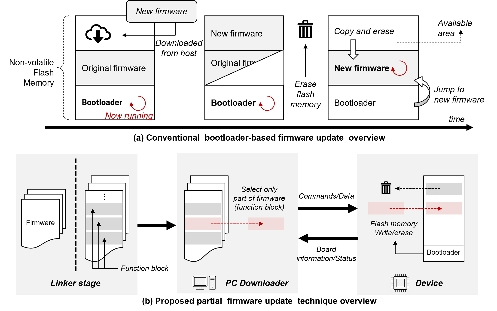
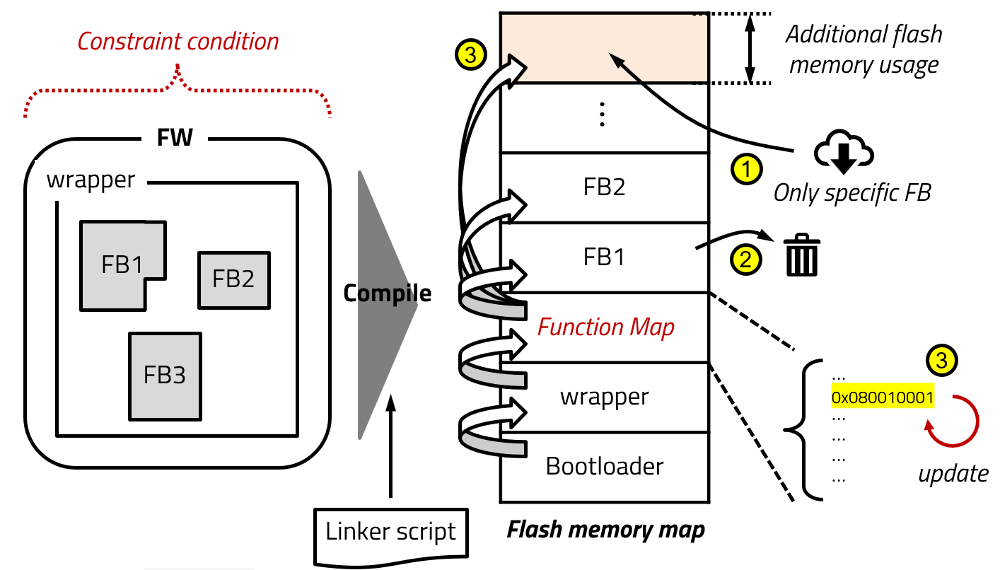
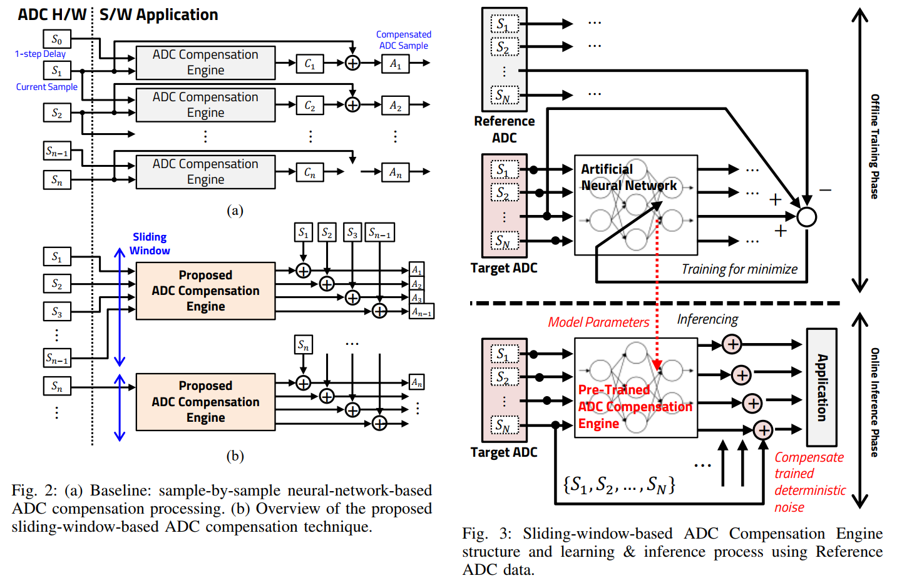
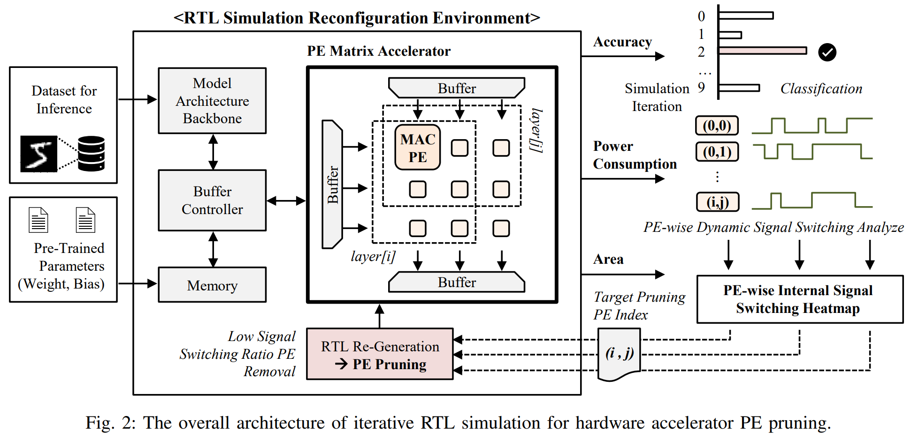
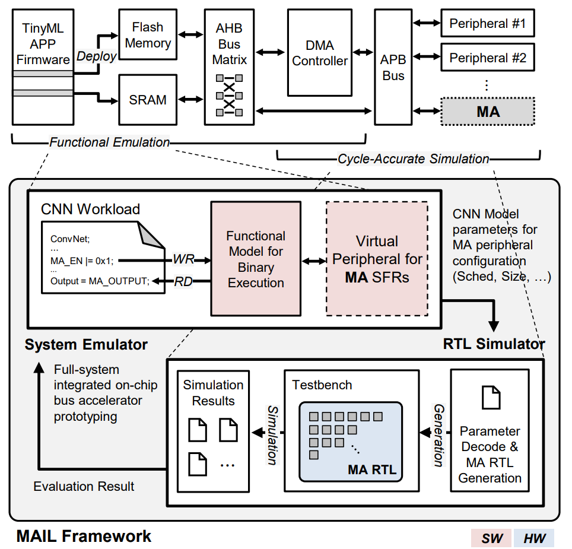
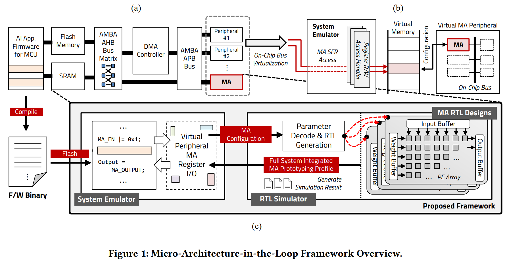
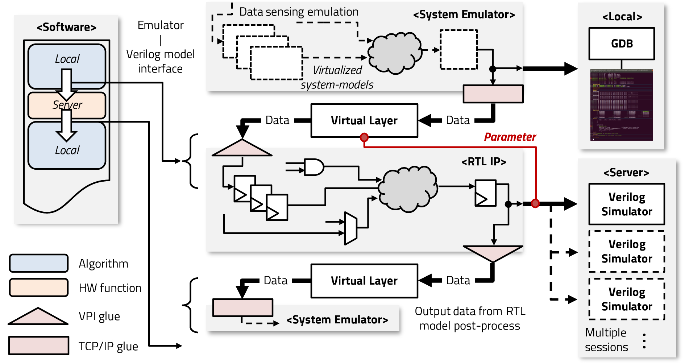
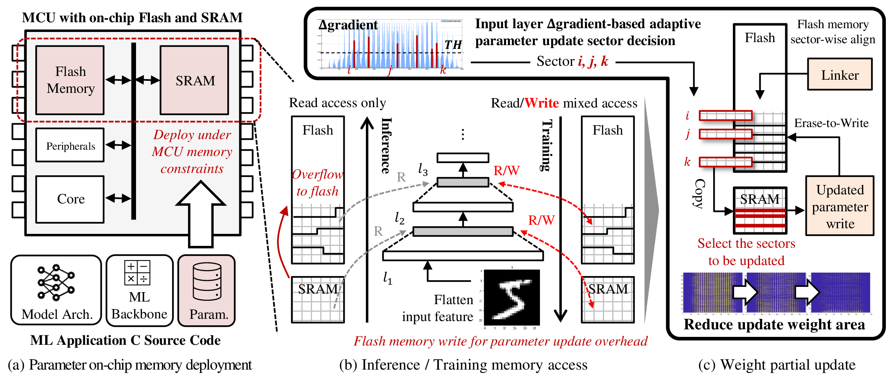
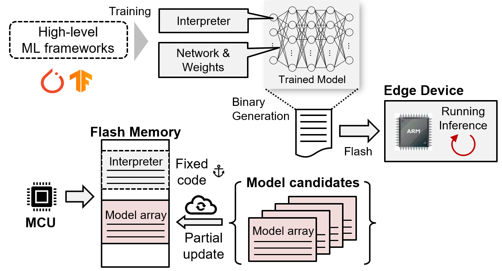

# 📝 Publications

## 1️⃣ Efficient Firmware

Journal

[<em>**IEICE TE’21**</em>] [Low-Power Fast Partial Firmware Update Technique of On-Chip 
Flash Memory for Reliable Embedded IoT Microcontroller](https://doi.org/10.1587/transele.2020LHP0001) \\
**<u>Jisu Kwon</u>**, Moon Gi Seok, and Daejin Park

<!--(Oral presentation, 1.2%)!-->

<!--<strong></strong>!-->

- Low-power, fast partial firmware update using function maps for efficient on-chip flash memory management. 

- Function map enables efficient updates by modifying block addresses without rewriting whole memory. 

- Reduces update time, energy use, and memory overhead in IoT microcontrollers.

<!-- 
ICLR 2024
 -->

Conference

[<em>**IEEE COOLChips’20**</em>] [User Insensible Sliding Firmware Update Technique for 
Flash-Area/Time-Cost Reduction toward Low-Power Embedded Software Replacement](https://doi.org/10.1109/COOLCHIPS49199.2020.9097638) \\
**<u>Jisu Kwon</u>**, Moon Gi Seok, and Daejin Park

<a href="https://1drv.ms/b/s!Ahw8uwAoq07JgqwenDtbBhtat-EnqQ?e=gnA4NC"><strong>Slides</strong></a>
\|
<a href="https://1drv.ms/v/s!Ahw8uwAoq07Jha0oOs2-2SYyRVfi9g?e=PZvejb"><strong>Video</strong></a>

- User insensible sliding firmware update reduces flash memory usage and device pause time by updating only function blocks instead of entire firmware. 

- Achieves 63.64% memory overhead reduction, 79.98% pause time reduction, and 78.78% energy consumption reduction.

- `Sensors’23` [Optimized Replication of ADC-Based Particle Counting Algorithm with Reconfigurable Multi-Variables in Pseudo-Supervised Digital Twining of Reference Dust Sensor Systems](https://doi.org/10.3390/s23125557), Seungmin Lee, **<u>Jisu Kwon</u>**, and Daejin Park.

- `IEEE Access’23` [Runtime Tracking-Based Replication of On-Chip Embedded Software Using Transfer Function Learning for Dust Particle Sensing Systems](https://doi.org/10.1109/ACCESS.2023.3263057), Seungmin Lee, **<u>Jisu Kwon</u>**, and Daejin Park.

- `IEEE Access’22` [Efficient Sensor Processing Technique Using Kalman Filter-Based Velocity Prediction in Large-Scale Vehicle IoT Application](https://doi.org/10.1109/ACCESS.2022.3215166), **<u>Jisu Kwon</u>**, and Daejin Park.
- `IEEE ICAIIC’22` [Implementation of Computation-Efficient Sensor Network for Kalman Filter-based Intelligent Position-Aware Application](https://doi.org/10.1109/ICAIIC48513.2020.9065098), **<u>Jisu Kwon</u>**, and Daejin Park.
- `IEEE ICCE-Asia’20` [Segmented Polynomial Approximation for Controlled System Characteristic Estimation on Lightweight Edge Device](https://doi.org/10.1109/ICCE-Asia49877.2020.9276901), Minsung Kim, Jongheon Baek, Jiwoong Jung, **<u>Jisu Kwon</u>**, and Daejin Park.
- `IEEE ISPACS’19` [Function Block-Based Robust Firmware Update Technique for Additional Flash-Area/Energy-Consumption Overhead Reduction](https://doi.org/10.1109/ISPACS48206.2019.8986373), **<u>Jisu Kwon</u>**, Jeonghun Cho, and Daejin Park.
- `IEEE COOLChips’19` Efficient Flash Memory Access Power Reduction Techniques for IoT-Driven Rare-Event Logging Application, **<u>Jisu Kwon</u>**, Jeonghun Cho, and Daejin Park. (Poster Session)

***

## 2️⃣ Efficient Hardware

<!-- 
ICLR 2024
 -->

Conference

[<em>**VLSI-TSA’25**</em>] [Sliding-Window-based Fast and Lightweight ADC Pseudo-Randomness 
Compensation Technique for Low-Cost ADC](https://doi.org/10.1109/VLSITSA64674.2025.11046543) \\
**<u>Jisu Kwon</u>**, and Daejin Park
<a href=""><strong>Slides</strong></a>
\|
<a href=""><strong>Poster</strong></a>

<!--<strong></strong>!-->

- Sliding-window-based ADC compensation reduces noise using neural networks. 

- Minimizes hardware usage, enhances ADC performance with software compensation. 

- Achieves 1.61× ENOB improvement, 5.82× processing time reduction under 20 dB noise.

<!-- 
ICLR 2024
 -->

Conference

[<em>**IEEE MWSCAS’23**</em>] [Hardware Accelerator Processing Element Unit Dynamic Pruning using 
Runtime RTL Simulation Reconfiguration](https://doi.org/10.1109/MWSCAS57524.2023.10406146) \\
**<u>Jisu Kwon</u>**, Heuijee Yun, and Daejin Park

<a href="https://1drv.ms/b/s!Ahw8uwAoq07JnLFG9LX7L1t-S7ad1A?e=7DkoqO"><strong>Poster</strong></a>

- Dynamic MAC unit pruning reduces neural accelerator area and power consumption by removing inactive processing elements. 

- Empirical RTL simulation analyzes signal switching to optimize pruning while maintaining accuracy. 

- Achieves up to 9.78% signal switching reduction, 4.25% area savings, and only 1% accuracy loss.

- `Applied Sciences’22` [Hardware/Software Co-Design for TinyML Voice-Recognition Application on Resource Frugal Edge Devices](https://doi.org/10.3390/app112211073), **<u>Jisu Kwon</u>**, and Daejin Park.

- `ISOCC’22` [Lightweighted AI-based Inference using Deterministic Randomness Compensation for Microcontroller ADC Resolution Enhancement](https://doi.org/10.1109/ISOCC56007.2022.10031497), **<u>Jisu Kwon</u>**, and Daejin Park.

- `JIPS’20` [GPU-Based ECC Decode Unit for Efficient Massive Data Reception Acceleration](https://doi.org/10.3745/JIPS.01.0060), **<u>Jisu Kwon</u>**, Moon Gi Seok, and Daejin Park.

***

## 3️⃣ SoC Verification

<!-- 
ICLR 2024
 -->

Journal

[<em>**Applied Sciences’25**</em>] [MAIL: Micro-Accelerator-in-the-Loop Framework for MCU Integrated 
Accelerator Peripheral Fast Prototyping](https://doi.org/10.3390/app15031056) \\
**<u>Jisu Kwon</u>**, and Daejin Park

- Micro-Accelerator-in-the-Loop (MAIL) framework enables fast prototyping of MCU-integrated accelerators for TinyML. 
- Combines software emulation and cycle-accurate RTL simulation to evaluate hardware-software interaction. 
- Supports parameter exploration for optimizing accelerator performance and resource usage. 
- Reduces latency and improves efficiency in TinyML applications.

<!-- 
ICLR 2024
 -->

Conference

[<em>**ACM/IEEE EMSOFT’23**</em>] [Work-in-Progress: Micro-Accelerator-in-the-Loop Framework for MCU 
Integrated Accelerator Peripheral Fast Prototyping](https://doi.org/10.1145/3607890.3608461) \\
**<u>Jisu Kwon</u>**, and Daejin Park

(BK21+ CS SCI Conference) \|
<a href="https://1drv.ms/b/s!Ahw8uwAoq07JnLFEw-rbFHWcq2cxCA?e=tmSnL4"><strong>Slides</strong></a>
\|
<a href="https://1drv.ms/b/s!Ahw8uwAoq07Jha9D4hfo2DLuDC_Lzw?e=QPNyZR"><strong>Poster</strong></a>

<!--<strong></strong>!-->

- Micro-Accelerator-in-the-Loop (MAIL) framework enables fast prototyping of MCU-integrated accelerators. 

- Combines system emulation and cycle-accurate RTL simulation for efficient performance profiling. 

- Achieves up to 84.32% and 61.32% cycle latency reduction in TinyML applications.

<!-- 
ICLR 2024
 -->

Conference

[<em>**IEEE ISCAS’21**</em>] [Metamorphic Edge Processor Simulation Framework Using Flexible 
Runtime Partial Replacement of Software-Embedded Verilog RTL Models,](https://doi.org/10.1109/ISCAS51556.2021.9401354) \\
**<u>Jisu Kwon</u>**, Sejong Oh, and Daejin Park

<a href="https://1drv.ms/b/s!Ahw8uwAoq07Jha4hlGBFzgTL1wWwAw?e=MvfaXq"><strong>Slides</strong></a>
\|
<a href="https://1drv.ms/v/s!Ahw8uwAoq07Jha4kj_RQJel8DrqPrw?e=c34at3"><strong>Video</strong></a>

- Metamorphic edge processor simulation framework accelerates RTL verification by replacing redundant models with software emulation. 

- Virtual layer enables dynamic partial RTL model replacement at runtime. 

- Achieves significant simulation speedup while maintaining parameter exploration flexibility.

- `IEEE ICAIIC’25` [A Dynamic Linking Framework for Efficient QEMU Peripheral Development and Maintenance](https://ieeexplore.ieee.org/document/10920785), Gihyeon Jeon, **<u>Jisu Kwon</u>**, and Daejin Park.

***

## 4️⃣ TinyML

<!-- 
ICLR 2024
 -->

Journal

[<em>**IEEE ESL’23**</em>] [Efficient Partial Weight Update Techniques for Lightweight On-Device Learning
on Tiny Flash-Embedded MCUs](https://doi.org/10.1109/LES.2023.3298731) \\
**<u>Jisu Kwon</u>**, and Daejin Park

<a href="https://1drv.ms/b/s!Ahw8uwAoq07JnLFCSOXpIN28wxZ0nw?e=vJgoll"><strong>Slides</strong></a>
\|
<a href="https://1drv.ms/b/s!Ahw8uwAoq07Jha8zIctKN3WWTFoTeA?e=FHnSSo"><strong>Poster</strong></a> \|
<a href="https://1drv.ms/v/s!Ahw8uwAoq07Jh71ruhkLCgcVawzsMQ?e=vI2I04"><strong>Video</strong></a>

- Partial weight update technique reduces memory usage in on-device learning by updating only selected weights stored in flash. 

- Gradient-based selection minimizes accuracy loss while optimizing SRAM usage. 

- Achieves 76.1% accuracy with only 18.52% weight updates, reducing APDP by up to 46.9%.

<!-- 
ICLR 2024
 -->

Conference

[<em>**HPC-Asia’21**</em>] [Toward Data-Adaptable TinyML Using Model Partial Replacement for Resource 
Frugal Edge Device](https://doi.org/10.1145/3432261.3439865) \\
**<u>Jisu Kwon</u>**, and Daejin Park

<a href="https://1drv.ms/b/s!Ahw8uwAoq07Jha4uMuLrP4iU9T4Hgg?e=ixQBbN"><strong>Poster</strong></a>
\|
<a href="https://1drv.ms/v/s!Ahw8uwAoq07Jha4zLKuO1bycos3bMw?e=T5YnIm"><strong>Video</strong></a>

- Model partial replacement enables data-adaptable TinyML by updating only specific network components in resource-limited edge devices. 

- Reduces model size, maintains accuracy, and optimizes flash memory usage. 

- Enhances inference efficiency without full firmware updates.

- `IEEE ISPACS’22` [Neural Network-based Approximate Quality Prediction for Parameter Exploration in Industrial Manufacturing](https://doi.org/10.1109/ISPACS57703.2022.10082830), **<u>Jisu Kwon</u>**, Moon Gi Seok, and Daejin Park.

***

## ️5️⃣️ Others

- `ACM TMCS’25` [Hyperparameter Tuning with Gaussian Processes for Optimal Abstraction Control in Simulation-based Optimization of Smart Semiconductor Manufacturing Systems](https://doi.org/10.1145/3646549), Moon Gi Seok, Wen Jun Tan, Wentong Cai, **<u>Jisu Kwon</u>**, and Seon Han Choi.

***

## 6️⃣ Domestic Journal Articles

- `IEMEK JESA’22` [Collaborative Streamlined On-Chip Software Architecture on Heterogenous Multi-Cores for Low-Power Reactive Control in Automotive Embedded Processors](https://doi.org/10.14372/IEMEK.2022.17.6.375), **<u>Jisu Kwon</u>**, and Daejin Park.
- `JKIICE’21` [Low-Power Metamorphic MCU using Partial Firmware Update Method for Irregular Target Systems Control](https://doi.org/10.6109/jkiice.2021.25.2.301), Jongheon Baek, Jiwoong Jung, Minsung Kim, **<u>Jisu Kwon</u>**, and Daejin Park.

- `JKIICE’20` [Acceleration of ECC Computation for Robust Massive Data Reception under GPU-based Embedded Systems](https://doi.org/10.6109/jkiice.2020.24.7.956), **<u>Jisu Kwon</u>**, and Daejin Park.

- `JKIICE’20` [Velocity and Distance Estimation-based Sensing Data Collection Interval Control Technique for Vehicle Data-Processing Overhead Reduction](https://doi.org/10.6109/jkiice.2020.24.12.1697), **<u>Jisu Kwon</u>**, and Daejin Park.

- `IEMEK JESA’19` [Efficient Flash Memory Access Power Reduction Techniques for IoT-Driven Rare-Event Logging Application](https://doi.org/10.14372/IEMEK.2019.14.2.87), **<u>Jisu Kwon</u>**, and Daejin Park.

***

##  7️⃣ Books and Chapters

Korean

[Low-Power Digital System Design - Practical Approach](https://books.google.co.kr/books?id=_oZOEAAAQBAJ), TNES, 2021. \\
Daejin Park, and **<u>Jisu Kwon</u>**

- This book covers low-power system-on-chip design methodologies and implementation techniques, from gate-level to architectural approach and software-hardware interfaces:
  - Toggle minimization in CMOS, gate, RTL, architecture, and software level.
  - Clock gating, data filtering-based toggle propagation minimization
  - Edge-triggered event-driven approach to reduce the active circuits
  - Multi-clock domain and asynchronous circuit design techniques using buffers.
  - Synchronizer between clock-crossing regions
  - Power-gating and architectural circuit design method

***

