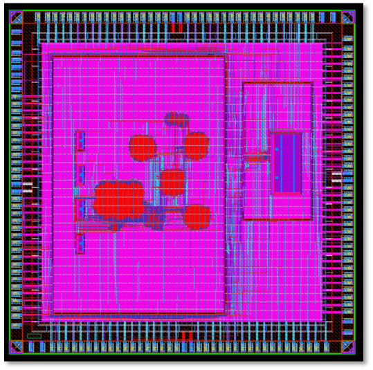
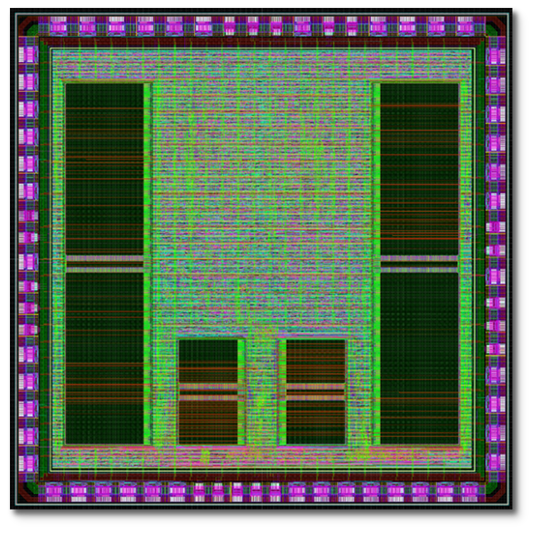
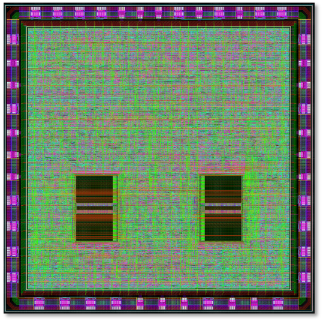
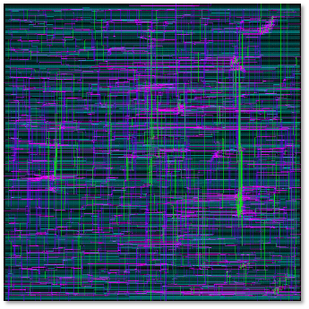

# 🛠 Chips

Jul.2024

[<em>**Samsung 28nm**</em>] **HAB-1**

- Reconfigurable Bridge between Host and integrated CNN Accelerator 
- Runtime bridge data transfer scheduling reconfigure support 
- 2-channel MPI interfaces for accelerator control
- Extra MPI external slot for scalable accelerator expansion

Dec.2023

[<em>**SK Key 130nm**</em>] **InfiniTYle**

- Arm Cortex-M0+ compatible custom ISA
- Custom SIMD instruction support
- Virtual scalable flash memory using off-chip QSPI interface
- 2-channel custom ***Tile-SoC*** interface for accelerator control

Dec.2023

[<em>**SK Key 130nm**</em>] **Tile-SoC**

- Tile-connected scalable CNN accelerator
- Connect in all four directions (up, down, left, and right) for scalable extension
- Accelerator compute utilization-aware load allocation by host (= ***InfiniTYle***)

Feb.2022

[<em>**Confidential**</em>] **DSI3 IP module for Ultrasonic Sensor**

- Tri-level current decoding link layer
- Discovery mode support for daisy chain address assignment
- Receive voltage command from master / transfer current response to slave
- Periodic Data Collection Mode (PDCM) support

Jan.2022

[<em>**Confidential**</em>] **SENT IP module for Force Sensor**

- Synchronization/Calibration pulse support
- Fast channel – Secure Message / High Speed Format support
- Slow channel – Short Serial Message / Enhanced Serial Message support
- Variable length pause pulse support 

Apr.2021

[<em>**DB HiTek 180nm**</em>] **I2S IP module for AMBA peripheral**

- APB DMA support
- External MCK, SCK, LRCK support
- Master/Slave and TX/RX support
- Small error LRCK frequency generation (22.05KHz, 44.1KHz, 48KHz, 96KHz, 192KHz)
- 2-types format support (Aligned, I2S)
- Mono channel support
- Interrupts support

